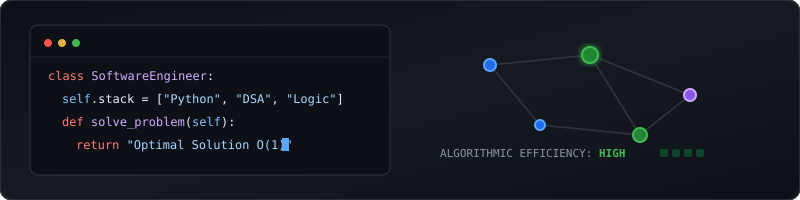

  <picture>
    <source media="(prefers-color-scheme: dark)" srcset="./dark.svg">
    <source media="(prefers-color-scheme: light)" srcset="./light.svg">
    
  </picture>

# Hi, I'm Mustapha 👋

Software Engineer specializing in Python-based problem solving, Data Structures, Algorithms, and high-efficiency system logic.

---

### 🛠 Tech Stack
- **Languages:** Python
- **Focus Areas:** Data Structures & Algorithms (DSA), System Design, Efficient Logic
